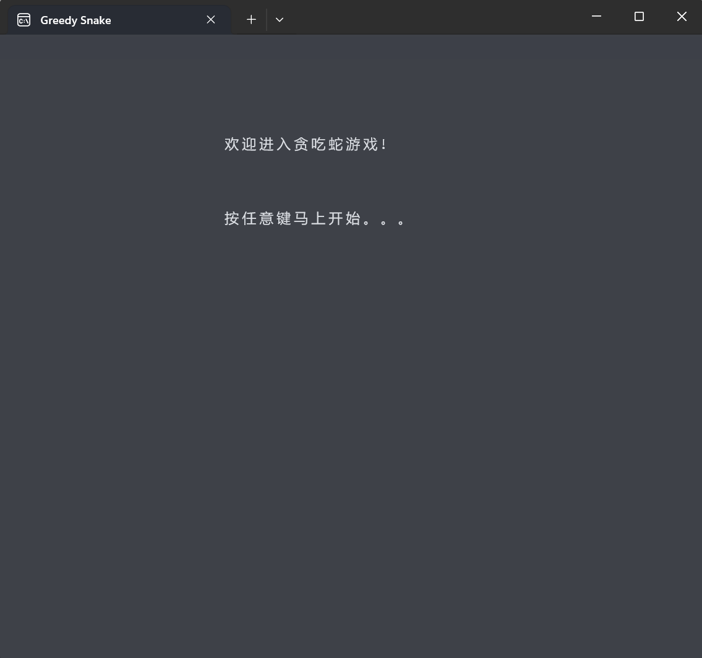
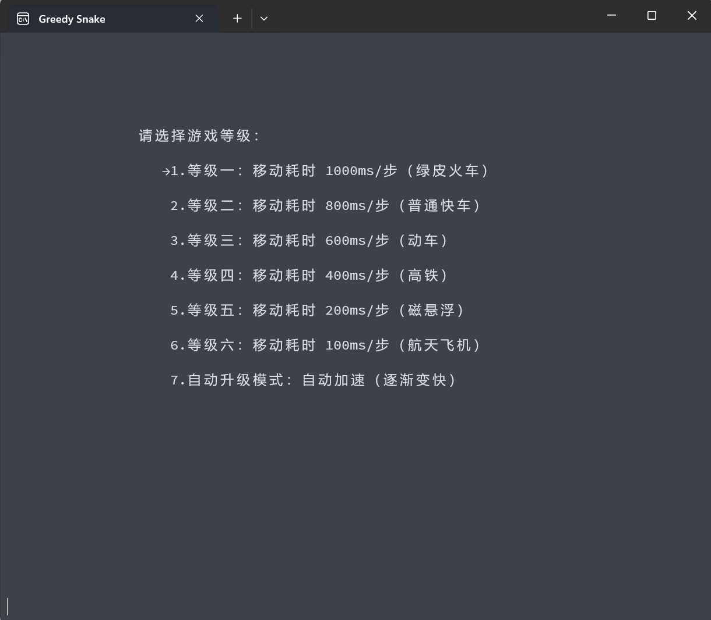
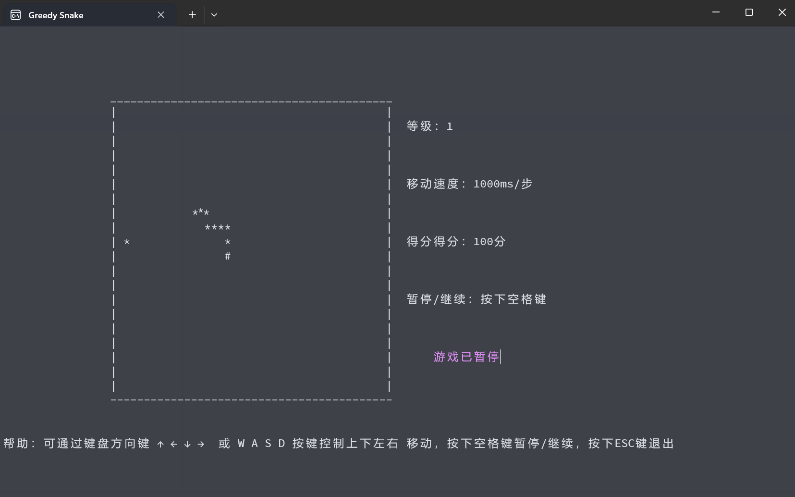
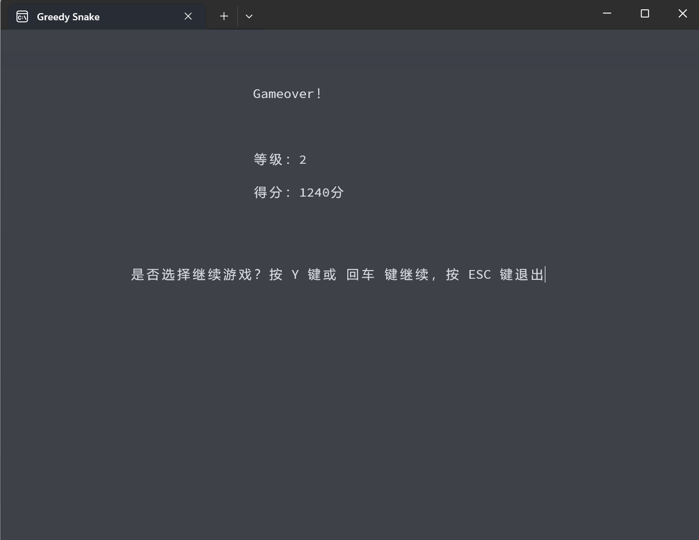

# 经典游戏---贪吃蛇从C++代码实现

## 1. 描述

小时候都玩过贪吃蛇这个经典的小游戏，在我们的普通手机里似乎都是必备的。它伴随着我们的童年，经历了好多好多时光。它带给我们了许多的乐趣。

2014年读大学时曾经在C++课程设计中做过这款小游戏，可能知道的网友应该看过我的那篇博客（[经典游戏---贪吃蛇从C++代码实现](http://t.csdnimg.cn/smwMR)）,
或许帮助了不少人完成了C++作业，也有些人从中觉得很有趣，能够帮助学习C++编程，也对我写的程序提出了很多的想法并指出了程序中的问题。

时隔多年，偶然的一个下午加一个晚上，抽了些许时间，对这个简单的小游戏做了些完善和修改，我把它重新优化了逻辑，并尽量不引入更加复杂的库和程序控制逻辑，使其看起来相对容易理解。

许多可玩性的东西，包括等级选择，暂停/继续和分数制都有完整的保留。

整个程序依然采用了类和数组的相关知识实现，为了能够避免刷屏导致的眼镜疲劳，引入了一些window.h的函数来控制光标位置和输出信息。

废话不多说，看图展示。







## 2. 更新内容

采用C++ 11版本以上，做好是C++17进行编译运行。推荐使用Clion Nova编译器运行。支持Cmake。

废弃了~~通过rand()函数来产生随机数~~，引入了C++11的新随机数生成库：

```c++
// c++11生成随机数的方式
std::default_random_engine e;
std::uniform_int_distribution<int> xrand(1, HEIGHT - 3); // 随机数分布类，可以确定随机数范围 [1,HEIGHT - 2]
std::uniform_int_distribution<int> yrand(1, WIDTH - 3); // 随机数分布类，可以确定随机数范围 [1, WIDTH - 2]
```

整个程序更进一步的引入面向对象的思想来设计，把原先直接在地图上通过数组直接显示整张地图（包括棋盘和蛇）的逻辑修改成：

- 坐标类：Position，用来标记地图上的每个坐标点，包括行x和列y信息，这个坐标采用地图map数组的相对值（而不是整个控制台的绝对值）。
- 蛇类：Snake，包装整个蛇头、蛇身、长度等信息，将吃米、移动等逻辑进行封装；
- 游戏类：Game，包括整个游戏的控制逻辑、输出显示、地图信息等等；

## 2. 分析思路

下面就来讲讲贪吃蛇的整个设计思路：

### 一、思考

贪吃蛇的特点是随机产生食物后，然后通过上下左右地方向键来控制贪吃蛇的移动，

当碰到食物时，便把它吃掉，从而身体长度增加一个，这里便采用“#”作为蛇头，“*”作为蛇身和食物。

### 二、吃食与不吃

然后便是吃食的问题了，当蛇头遇到一个食物时（食物在贪吃蛇前进的方向上），便将该食物变为蛇头，然后将原先的蛇头变为蛇身，从而达到了吃食的目的。

那如果没有碰到食物呢？就按照原来的方向或者键盘按下的方向继续前进就是了。

这里蛇的移动采用了一种巧妙的做法：

1. 吃米：如果蛇头前方是食物，那么只需要把蛇头“#”改成蛇身“*”，食物“*”修改显示为“#”（变成蛇头），并把蛇头坐标进行更新为食物的坐标即可，其他不变；
2. 不吃米：蛇头前方是空白，那么控制蛇向前移动，只需要将蛇头“#”改为蛇身“
   *”，前方的空白更新为新的蛇头“#”，但由于并没有吃到食物，所以这里需要把蛇尾“*”改成空白，蛇尾坐标前进一个即可。
3. 整个蛇采用一个N = (WEIGHT - 2) * (HEIGHT - 2)大小的数组进行保存整个蛇身蛇头的坐标信息（基于循环队列的思想），不断地保存新的坐标，删除旧的坐标。

### 三、实现

下面就是实现的问题了，如何将每个动态都展现出来呢？就是说贪吃蛇是一下一下往前移动的，这个又是如何实现的呢？

蛇的移动分为两种：

1. 人为按下方向键进行控制
2. 自动朝着前进方向移动

按键的捕获使用了_kbhit()函数监听按键事件，通过_getch()
来捕捉具体的按键信息。但需要注意的是，对于功能键（上下左右、空格、回车、ESC这种），_getch()需要捕获两次才可以，
而对于字母和数字按键，只需要捕获一次。

针对自动移动机制，这里我使用了clock()函数，下面是相关知识：

clock()是C/C++中的计时函数，而与其相关的数据类型是clock_t。在MSDN中，查得对clock函数定义如下：

```c++
clock_t clock(void) ;
```

简单而言，就是该程序从启动到函数调用占用CPU的时间。这个函数返回从“开启这个程序进程”到“程序中调用clock()
函数”时之间的CPU时钟计时单元（clock tick）数，在MSDN中称之为挂钟时间（wal-clock）；若挂钟时间不可取，则返回-1。其中clock_t是用来保存时间的数据类型。

因此，通过定义

```c++
int start = clock();while(clock()-start<=gamespeed);
```

这样一个方式来达到了延时的目的，延时的时间则根据gamespeed的值来确定，当gamespeed值越小时，延时时间越短。

经过延时后，再执行下一步代码，从而实现了贪吃蛇自动前进的功能和控制其前进的速度啦。

然而，仅仅有这些还是不行的，还需要解决输出问题。

旧版的程序中使用了`system("cls")`进行清屏（全局刷新），在每次蛇移动后，都需要清除整个屏幕，然后再把整张地图和其他信息进行输出显示，所以整体上看上去会不断地闪屏。

为了解决这个问题，新版的程序采用局部刷新的办法，使用了定位光标的办法进行解决，将光标移动到对应的坐标点上，再输出指定内容即可达到局部刷新的目的，
从而彻底解决了闪屏的问题，但还有点小瑕疵（光标隐藏没有处理好，依然可以看到“|”的光标）

### 四、 娱乐性

保留旧版设计的娱乐性的功能：等级选择、自动加速功能，等级越高，贪吃蛇移动速度越快，而且得分越高。
得分规则：

```c++
score += grade*20;
```

考虑到游戏的功能性，在游戏结束后输出得分情况，并提示是否继续游戏，而不是直接退出游戏，这样用户就不必每次游戏失败后重新打开程序进行游戏，
而是通过选择的方式决定继续游戏或者退出游戏。

加入暂停功能，当玩家玩累了，需要暂停的时候，按下空格（space）键实现暂停/继续。

优化了旧版中存在的暂停bug。